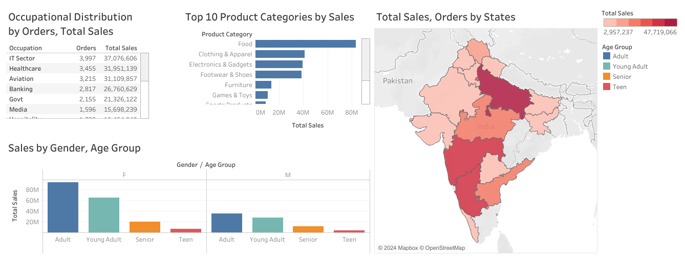

# Diwali Sales Analysis - Tableau Dashboard

## Workflow
1. **Data Cleaning and Preparation**:
   - Data cleaning and feature engineering were performed using Python (Pandas and Numpy).
   - Exported the processed dataset as `processed_data.csv` for visualization.

2. **Dashboard Creation**:
   - Tableau was used to create interactive visualizations and dashboards.
   - Key metrics such as sales, orders, and customer demographics were analyzed and visualized.

## Dashboard Highlights
### Charts Created:
1. **Bar Chart**: Top 10 product categories by sales.
2. **Side-by-Side Chart**: Sales by age group and gender.
3. **Map Chart**: Sales and orders by states.
4. **Text Table**: Occupational distribution by orders and total sales.

### Interactive Features:
- Filters for state, gender, and age group.
- Interconnected visualizations enabling deeper insights.

## Outputs
### Dashboard Preview:

### Interactive Dashboard Link:
[View the Dashboard](https://public.tableau.com/views/dashboard_17323611107920/Dashboard1?:language=en-US&:sid=&:redirect=auth&:display_count=n&:origin=viz_share_link)

## Insights
- **Top Categories**: Food, Clothing & Apparel lead in sales.
- **Demographics**: Young Adults contribute significantly to sales.
- **Geographical Trends**: Maharashtra and Uttar Pradesh are top-performing states.

## Files
- `dashboard.png`: Screenshot of the Tableau dashboard.
- `processed_data.csv`: Dataset used in Tableau visualizations.

